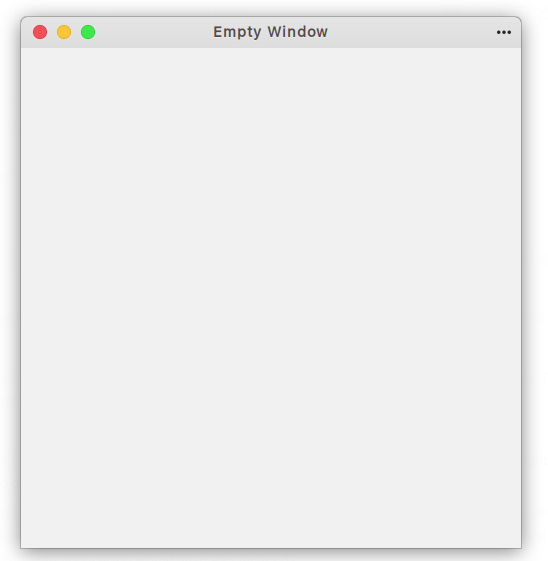

# EMPTY WINDOW

This is the very first program in GTK (GTK+ 3) C Tutorial

This program is used to create an empty window

Here is the sample output:

**STEPS AND METHODS:**

1. **Creating a window: **`gtk_application_window_new()`  method is used to create a new window (GtkWidget object)

2. **Setting title: **`gtk_window_set_title()` method is used to set the title name for window (GtkWindow object)*

3. **Setting size:** `gtk_window_set_default_size()` method is used to set the size of the window (GtkWindow object)*

   \* for steps 2 and 3, the GtkWidget object is typcasted into a GtkWindow object using `GTK_WINDOW()` method

4. **Enabling for view:** `gtk_widget_show_all()` method is used to show the window object

5. **Packing: ** We have to pack those steps inside a `static void activate(GtkApplication*, gpointer)` method

6. **Creating app: ** `gtk_application_new()` method is used to create a GTK Application
7. **Connecting app: ** `g_signal_connect()`method is used to connect the components inside the `active()` method using _"activate"_ as a second argument

8. **Running app: ** `g_application_run()` method is used to run the GTK Application
9. **Final step: ** `` method is used to clear the memory resources after GTK Application exits