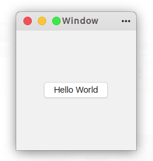

# BUTTON EXAMPLE

**SAMPLE OUTPUT: **

**Hierarchy: ** Window -> Button Box -> Button

* Window: `gtk_application_window_new()`

* Button Box: `gtk_button_box_new()`

* Button: `gtk_button_new_with_label()`

* _Adding Button to Button Box_

  `gtk_container_add(GTK_CONTAINER(button_box), button)`

* _Adding Button Box to Window_

  `gtk_container_add(GTK_CONTAINER(window), button_box)`

* `g_signal_connect()` method is triggered while the specified action is performed and `g_signal_connect_swapped()` method is triggered after the specified action is completed